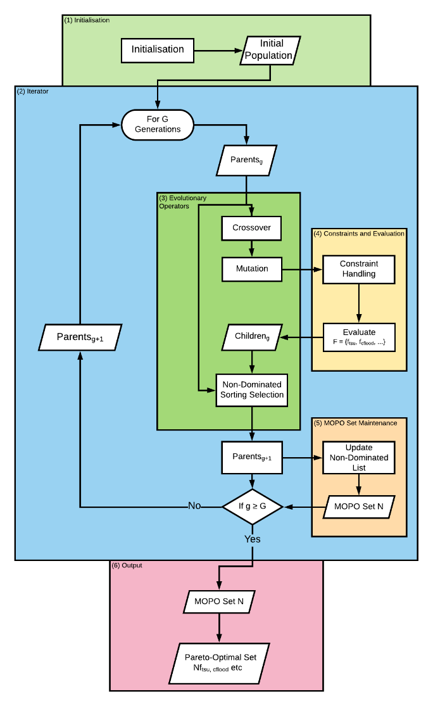

<br />
<p align="center">
  <a href="https://github.com/samarchie/urban-optim">
    
  </a>

  <h3 align="center">Multi-Criterion Spatial Optimisation</h3>

  <p align="center">
    Building a stronger future for all
    <br />
    <a href="http://urutau.co.nz/research/spatial_optimization"><strong>Explore the docs »</strong></a>
    <br />
    <br />
    <a href="https://samarchie.github.io/urban-optim">View Demo</a>
    ·
    <a href="https://github.com/samarchie/urban-optim/issues">Report Bug</a>
    ·
    <a href="https://github.com/samarchie/urban-optim/issues">Request Feature</a>
  </p>
</p>


## Table of Contents

* [About the Project](#about-the-project)
  * [Built With](#built-with)
* [Getting Started](#getting-started)
* [Usage and Workflow](#usage-and-workflow)
* [Roadmap](#roadmap)
* [Contributing](#contributing)
* [Contact](#contact)
* [Acknowledgements](#acknowledgements)


## About The Project

> Archie, S. W,. Fleming, J. N., & Logan, T. M. (2020).  Multi-Criterion Spatial Optimisation of Christchurch's Urban Development. *Proceedings of the University of Canterbury Civil and Natural Resources Engineering Research Conference 2020*

This package aims to find an optimal, or a series of optimal, scenarios of urban development plans that are better for a range of attributes (known as objective functions).

### Built With
**Python 3.8 with the following modules:**

* []() geopandas (0.8.1)
* []() deap (1.3.1)
* []() matplotlib (3.3.1)
* []() rasterIO (1.1.5)
* []() descartes (1.1.0)
* []() rasterstats (0.15.0)
* []() plotly (4.11.0)
* []() kaleido (0.0.3.post1)


## Getting Started

To get a local copy up and running to perform your own analysis, follow these simple steps.

1. Clone the repo
```sh
git clone https://github.com/samarchie/urban-optim.git
```
2. Download and install [Python 3.8.2](https://www.python.org/downloads/release/python-382/)

3. Create a virtual environment and install required modules listed above. Instructions are available from [the Python Packaging docs](https://packaging.python.org/guides/installing-using-pip-and-virtual-environments/)

4. Collate geo-spatial datasets (if applicable)
  1. Download relevant geo-spatial datasets in the form of shapefiles of TIFF images.
  2. Place them in the `/data` folder, or in various sub-folders (up to user)
  2. Amend the `get_data()` module in `src/initilisation.py` to point to the right filepaths of newly located datasets

5. Define further necessary objective functions in src/objective_functions.py (if applicable)

6. Run code through calling `main.py` (shown below) in a virtual environment, and follow requests for input from the terminal
```sh
python src/main.py
```

## Usage and Workflow

_For examples on how the framework can be used and is implemented, please refer to the case-study  [Documentation of Ōtautahi Christchurch, New Zealand](https://samarchie.github.io/urban-optim)_

The workflow of the code is simply visualised in the flowchart below.




## Roadmap
Further works are being completed to expand the framework to positive amenity objective function, such that quality of life is maximised while hazard risks are minimised.

Two more case studies are to be developed - Queenstown (NZ) and Tauranga (NZ). Currently, the package only considers six objective functions only for Christchurch. Further work is to make the entire framework open-ended for any urban area - including those outside of New Zealand.

See the [open issues](https://github.com/samarchie/urban-optim/issues) for a list of further proposed features (and known issues).


## Contributing

Contributions are what make the open source community such an amazing place to be learn, inspire, and create. Any contributions you make are **greatly appreciated**.

1. Fork the Project
2. Create your Feature Branch (`git checkout -b feature/AmazingFeature`)
3. Commit your Changes (`git commit -m 'Add some AmazingFeature'`)
4. Push to the Branch (`git push origin feature/AmazingFeature`)
5. Open a Pull Request


## Contact

Project Supervisor: [Tom Logan (via email)](mailto:tom.logan@canterbury.ac.nz)

Project Link: [https://github.com/samarchie/urban-optim](https://github.com/samarchie/urban-optim)

Project Documentation: [https://samarchie.github.io/urban-optim](https://samarchie.github.io/urban-optim)


## Acknowledgements

We thank Dai Kiddle and Mitchell Anderson (University
of Canterbury) for their contribution to data manipulation
and methods.
