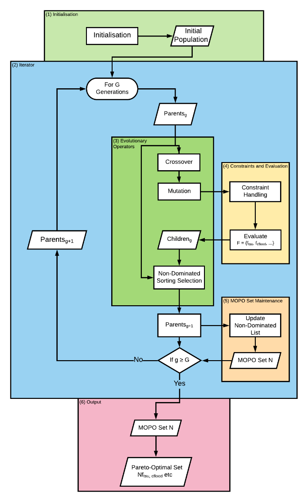
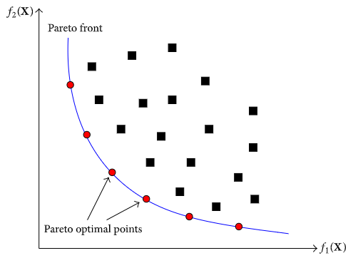
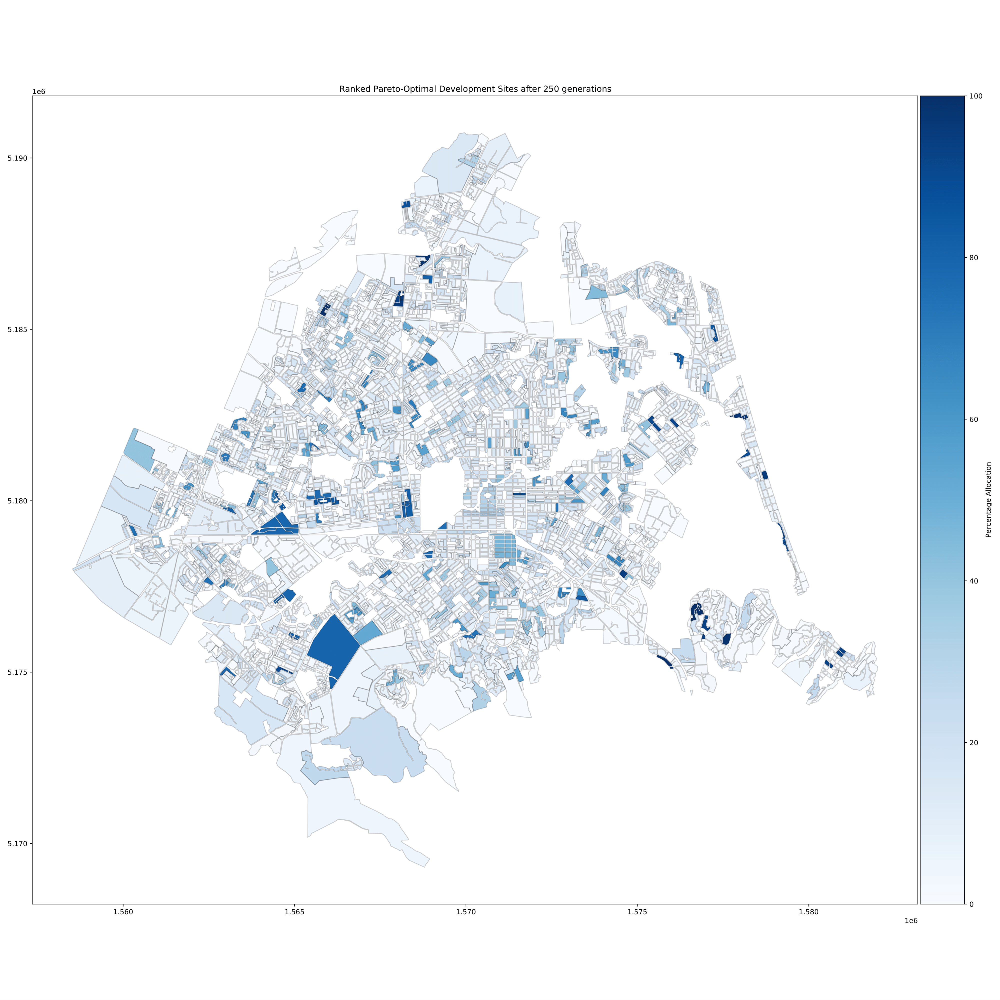

## Figures from the Analysis for Ōtautahi Christchurch

Sam Archie & Jamie Fleming, supervised by Tom Logan; (2020)

 

**Figure 1.** Proportions of existing urban densities of Christchurch in 2018, by statistical area. *Note: A 3D interactive spatial plot of existing densities can be found [here](https://samarchie.github.io/urban-optim/chch-existing-density.html)*

 

**Figure 2.** Computational flowchart of the genetic algorithm used to implement the multi-objectional spatial optimisation framework. (Modified from Caparros-Midwood et al., 2016).

 

**Figure 3.** Demonstration of the Pareto front for two objectives. (Reproduced from Wang et al., 2015).

 

**Figure 4.** Performance of Pareto-optimal spatial plans that dominate in one objective across all objectives. (Parents = 250, Generations = 250, Balanced weightings, High dwelling projection)

 

**Figure 5.** Ranked Pareto-optimal development sites. Darker blue signifies where statistical areas appeared more often in the MOPO sets. (Parents = 250, Generations = 250, Balanced weightings, High dwelling projection)

 

**Figure 6.** Spatial variability of urban densities of Ōtautahi Christchurch, by statistical area, where the height and colour of the extruded statistical areas indicate relative urban density. (top) 2018 density, (middle) added average added density of top 1% of development plans ranked by combined objective functions and (bottom) combination of the two above spatial plans, which envisions a more sustainable urban environment of Ōtautahi Christchurch.

 
 
Further figures not included in the report can be found

 
 
 
If at anytime you find yourself lost, click [here](https://samarchie.github.io/urban-optim) to go home
