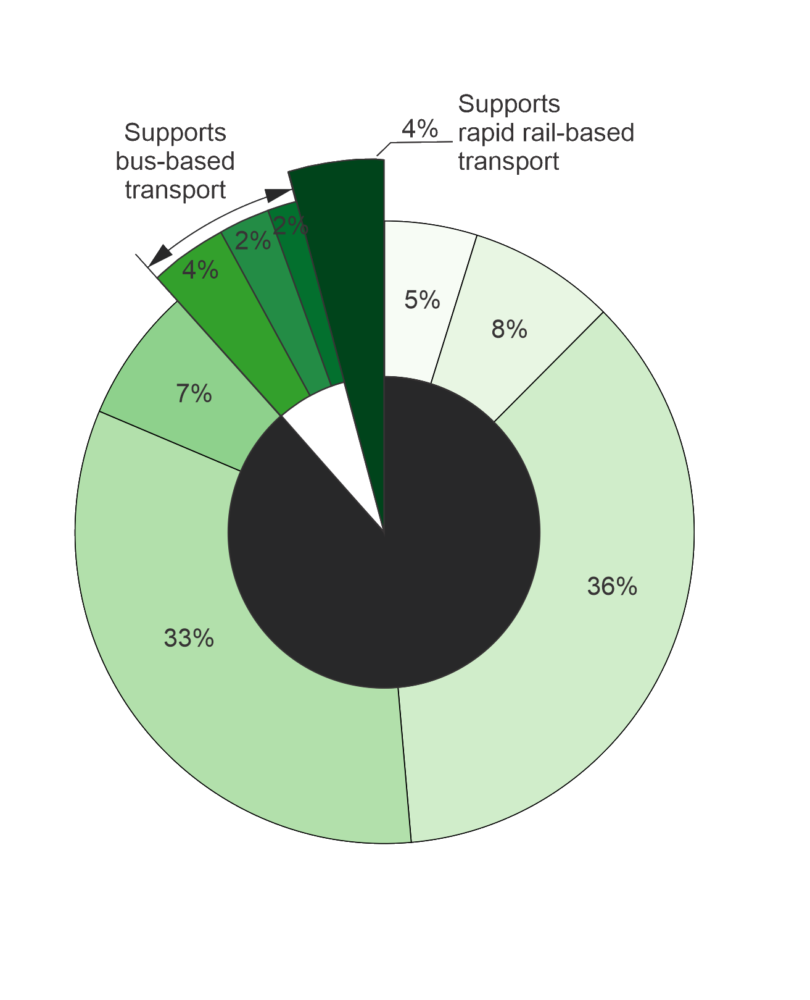

## Figures from the Analysis for Ōtautahi Christchurch

Sam Archie & Jamie Fleming, supervised by Tom Logan; (2020)

 

**Figure 1.** Proportions of existing urban densities of Christchurch in 2018, by statistical area, indicating where different transport methods can be supported as outlined by Chakrabarti (2013). *Note: A 3D interactive spatial plot of existing densities can be found [here](https://samarchie.github.io/urban-optim/chch-existing-density.html)*

 

**Figure 2.** Computational flowchart of the genetic algorithm used to implement the multi-objectional spatial optimisation framework. (Modified from Caparros-Midwood et al., 2016).

 

**Figure 3.** Demonstration of the Pareto front for two objectives. (Reproduced from Wang et al., 2015).

 

**Figure 4.** Parametrized spatial dataset for each objective function of the Ōtautahi Christchurch case study. A darker shade of red indicates that the statistical area has a high objective function score.

 

**Figure 5.** Performance of Pareto-optimal spatial plans that dominate in one objective across all objectives. (Parents = 1000, Generations = 200, Balanced weightings, High dwelling projection)

 

**Figure 6.** Ranked Pareto-optimal development sites. Darker blue signifies where statistical areas appeared more often in the MOPO sets. (Parents = 1000, Generations = 200, Balanced weightings, High dwelling projection)

 

**Figure 7.** Spatial variability of envisioned urban densities of Ōtautahi Christchurch, by statistical area, where the height and colour of the extruded statistical areas indicate relative urban density. (Parents = 1000, Generations = 200, Balanced weightings, High dwelling projection). *Note: A 3D interactive spatial plot of envisioned densities can be found [here](https://samarchie.github.io/urban-optim/chch-results-density.html)*

 
 
Further figures not included in the report can be found [here](https://samarchie.github.io/urban-optim/chch-supplementary-figs)

 
 
 
If at anytime you find yourself lost, click [here](https://samarchie.github.io/urban-optim) to go home
