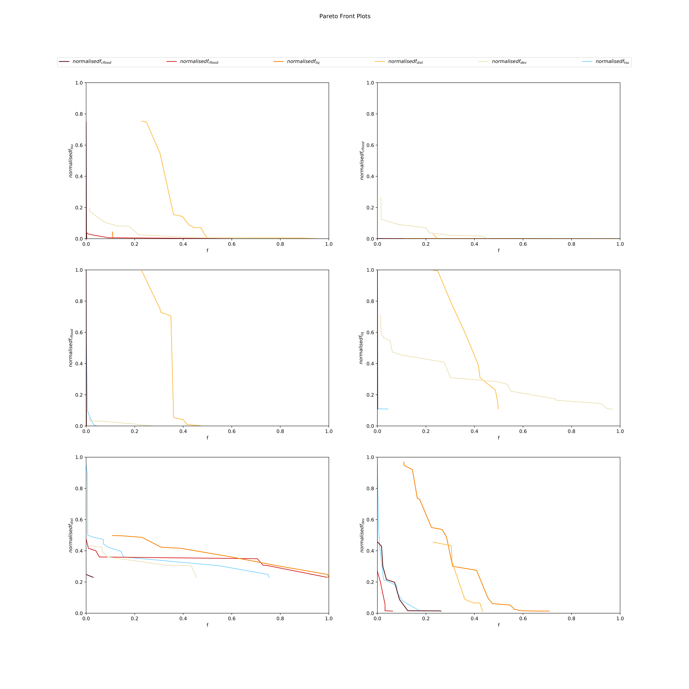
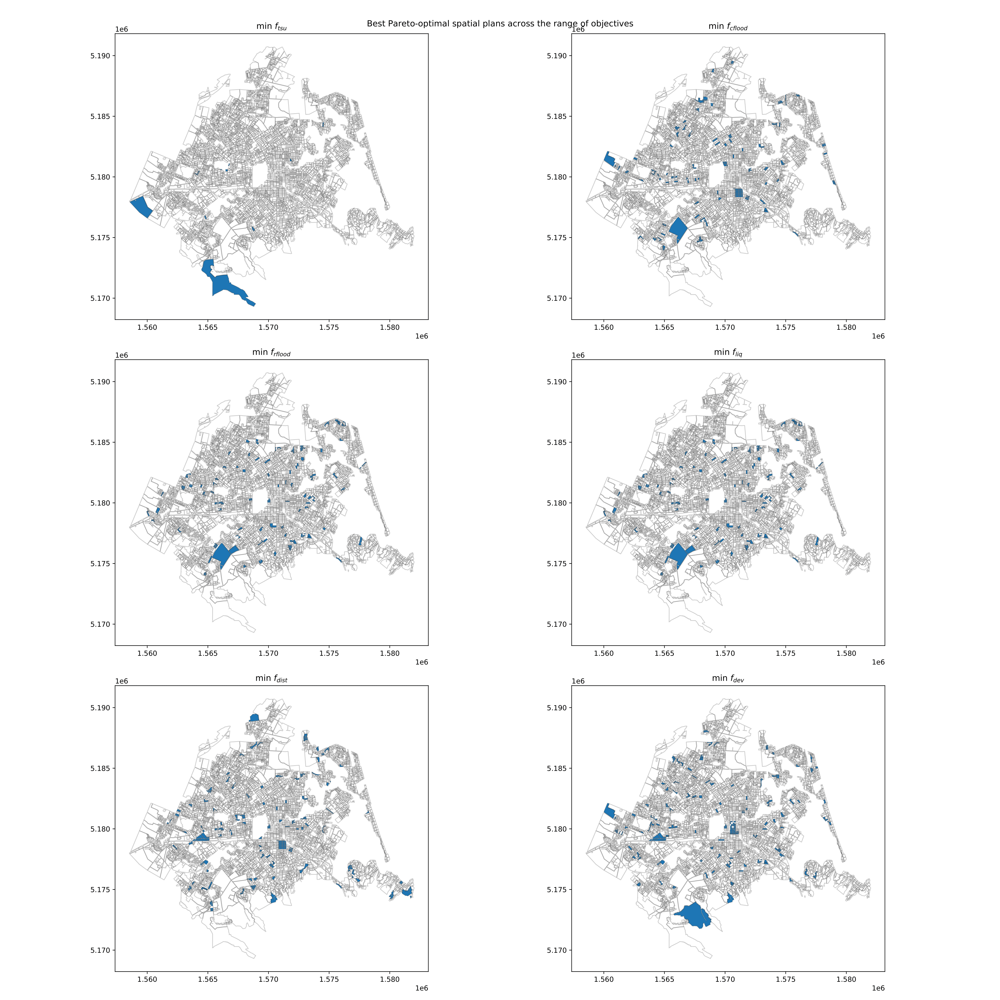

## Supplementary Figures from the Analysis for Ōtautahi Christchurch

Sam Archie & Jamie Fleming, supervised by Tom Logan; (2020)

 

**Figure 1.** Combined map of overall objective scores of each statistical area in Ōtautahi Christchurch, using a balanced weighting scheme between objective functions. A darker shade of red indicates a higher total objective function score.

 

**Figure 2.** Pareto fronts. Each set of axis compares one of the objective functions to the other five. (Parents = 250, Generations = 250, Balanced weightings, High dwelling projection)

 

**Figure 3.** Spatial plots of development plans in the MOPO set for the Ōtautahi Christchurch case study. Each plot represents the development plan that achieved the lowest score in the respective objective. (Parents = 250, Generations = 250, Balanced weightings, High dwelling projection)
